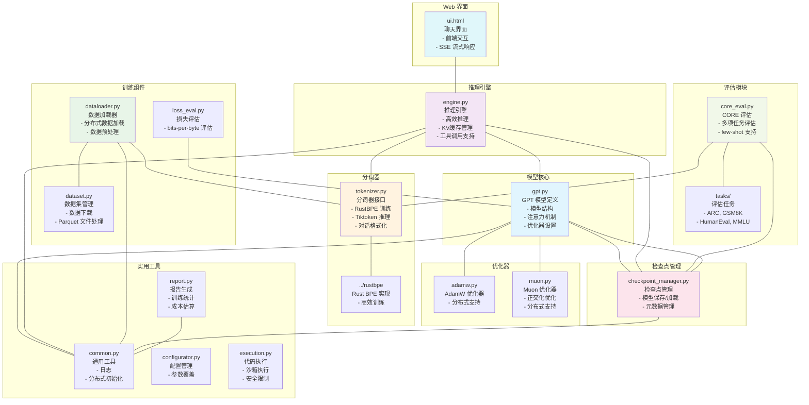

该仓库基于[nanochat](https://github.com/karpathy/nanochat)构建。

```mermaid
graph TD
    subgraph "模型核心"
        A[gpt.py<br/>GPT 模型定义<br/>- 模型结构<br/>- 注意力机制<br/>- 优化器设置]
    end

    subgraph "推理引擎"
        B[engine.py<br/>推理引擎<br/>- 高效推理<br/>- KV缓存管理<br/>- 工具调用支持]
    end

    subgraph "训练组件"
        C[dataloader.py<br/>数据加载器<br/>- 分布式数据加载<br/>- 数据预处理]
        D[dataset.py<br/>数据集管理<br/>- 数据下载<br/>- Parquet 文件处理]
        E[loss_eval.py<br/>损失评估<br/>- bits-per-byte 评估]
    end

    subgraph "优化器"
        F[adamw.py<br/>AdamW 优化器<br/>- 分布式支持]
        G[muon.py<br/>Muon 优化器<br/>- 正交化优化<br/>- 分布式支持]
    end

    subgraph "分词器"
        H[tokenizer.py<br/>分词器接口<br/>- RustBPE 训练<br/>- Tiktoken 推理<br/>- 对话格式化]
        I[../rustbpe<br/>Rust BPE 实现<br/>- 高效训练]
    end

    subgraph "检查点管理"
        J[checkpoint_manager.py<br/>检查点管理<br/>- 模型保存/加载<br/>- 元数据管理]
    end

    subgraph "评估模块"
        K[core_eval.py<br/>CORE 评估<br/>- 多项任务评估<br/>- few-shot 支持]
        L[tasks/<br/>评估任务<br/>- ARC, GSM8K<br/>- HumanEval, MMLU]
    end

    subgraph "实用工具"
        M[common.py<br/>通用工具<br/>- 日志<br/>- 分布式初始化]
        N[configurator.py<br/>配置管理<br/>- 参数覆盖]
        O[report.py<br/>报告生成<br/>- 训练统计<br/>- 成本估算]
        P[execution.py<br/>代码执行<br/>- 沙箱执行<br/>- 安全限制]
    end

    subgraph "Web 界面"
        Q[ui.html<br/>聊天界面<br/>- 前端交互<br/>- SSE 流式响应]
    end

    %% 依赖关系
    A --- F
    A --- G
    A --- J
    A --- M
    
    B --- A
    B --- H
    B --- J
    B --- M
    
    C --- D
    C --- H
    C --- M
    
    E --- A
    
    H --- I
    
    J --- A
    J --- M
    
    K --- J
    K --- H
    K --- L
    
    O --- M
    
    Q --- B

    style A fill:#e1f5fe
    style B fill:#f3e5f5
    style C fill:#e8f5e8
    style H fill:#fff3e0
    style J fill:#fce4ec
    style K fill:#f1f8e9
    style Q fill:#e0f7fa
```