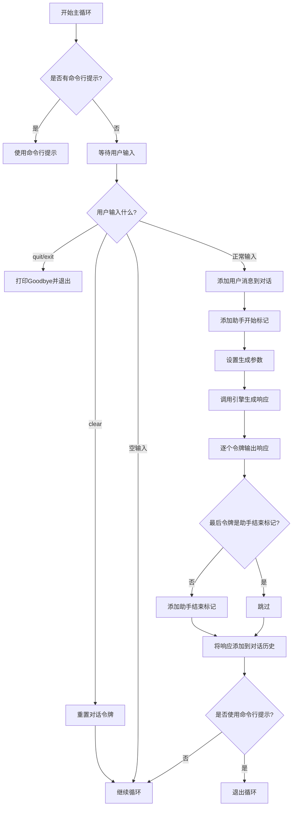

```mermaid
flowchart TD
    A[开始主循环] --> B{是否有命令行提示?}
    B -->|是| C[使用命令行提示]
    B -->|否| D[等待用户输入]
    D --> E{用户输入什么?}
    E -->|quit/exit| F[打印Goodbye并退出]
    E -->|clear| G[重置对话令牌] --> H[继续循环]
    E -->|空输入| H
    E -->|正常输入| I[添加用户消息到对话]
    I --> J[添加助手开始标记]
    J --> K[设置生成参数]
    K --> L[调用引擎生成响应]
    L --> M[逐个令牌输出响应]
    M --> N{最后令牌是助手结束标记?}
    N -->|否| O[添加助手结束标记]
    N -->|是| P[跳过]
    O --> Q[将响应添加到对话历史]
    P --> Q
    Q --> R{是否使用命令行提示?}
    R -->|是| S[退出循环]
    R -->|否| H
```