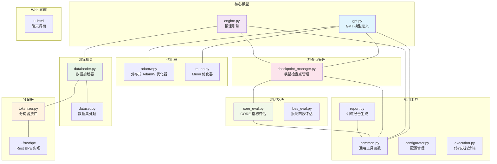

# NanoChat 模块结构关系图

```mermaid
graph TD
    subgraph "核心模型"
        GPT[gpt.py<br/>GPT 模型定义]
        ENGINE[engine.py<br/>推理引擎]
    end

    subgraph "训练相关"
        DATALOADER[dataloader.py<br/>数据加载器]
        DATASET[dataset.py<br/>数据集处理]
        ENGINE --- DATALOADER
        DATALOADER --- DATASET
    end

    subgraph "优化器"
        ADAMW[adamw.py<br/>分布式 AdamW 优化器]
        MUON[muon.py<br/>Muon 优化器]
        GPT --- ADAMW
        GPT --- MUON
    end

    subgraph "分词器"
        TOKENIZER[tokenizer.py<br/>分词器接口]
        RUSTBPE[../rustbpe<br/>Rust BPE 实现]
        TOKENIZER --- RUSTBPE
        DATALOADER --- TOKENIZER
    end

    subgraph "检查点管理"
        CHECKPOINT[checkpoint_manager.py<br/>模型检查点管理]
        GPT --- CHECKPOINT
        ENGINE --- CHECKPOINT
    end

    subgraph "评估模块"
        CORE_EVAL[core_eval.py<br/>CORE 指标评估]
        LOSS_EVAL[loss_eval.py<br/>损失函数评估]
        CHECKPOINT --- CORE_EVAL
    end

    subgraph "实用工具"
        COMMON[common.py<br/>通用工具函数]
        CONFIG[configurator.py<br/>配置管理]
        REPORT[report.py<br/>训练报告生成]
        EXECUTION[execution.py<br/>代码执行沙箱]
    end

    subgraph "Web 界面"
        UI[ui.html<br/>聊天界面]
    end

    GPT --- COMMON
    ENGINE --- COMMON
    CHECKPOINT --- COMMON
    CORE_EVAL --- COMMON
    REPORT --- COMMON

    style GPT fill:#e1f5fe
    style ENGINE fill:#f3e5f5
    style DATALOADER fill:#e8f5e8
    style TOKENIZER fill:#fff3e0
    style CHECKPOINT fill:#fce4ec
    style CORE_EVAL fill:#f1f8e9
```